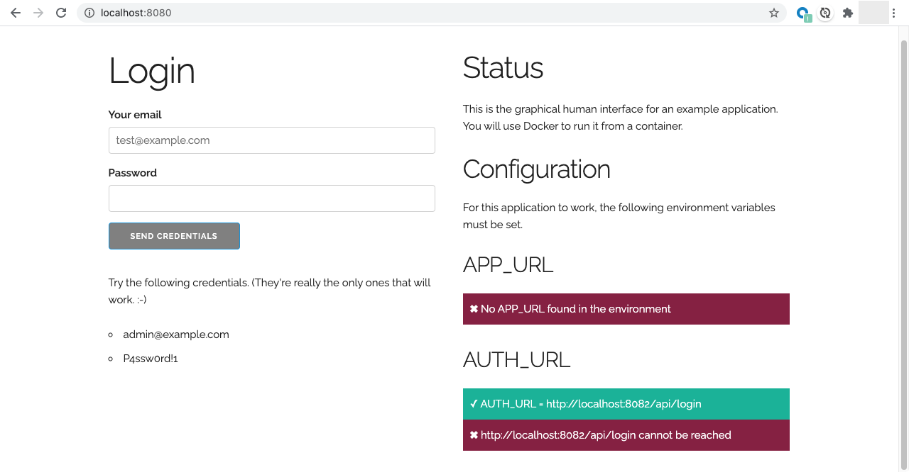

# Dockerize three apps

In this exercise, you'll Dockerize three applications that work together to make
a simple To-Do application. The three applications are:

* A front-end graphical human interface (**ghi**) that serves HTML, CSS, and
  JavaScript
* An authorization service (**auth**) that allows you to log into the application
* A to-do service (**app**) that manages the items in your list

**Fork this application to your own repository. That will be what you submit.**

## Running the applications without Docker

You'll need both Node.js v14+ and Python 3 installed on your computer to run all
three applications. (For those of you on macOS, you can install Python 3 with
`brew install python3`. For Linux users, check out your favorite package manager
if it's not already installed on there.)

To see the application in action, you can open three terminals and run the following
commands:

* For **app**, run `PORT=8081 npm run start`
* For **auth**, run `PORT=8082 npm run start`
* For **ghi**, run `PORT=8080 APP_URL=http://localhost:8081/api/items AUTH_URL=http://localhost:8082/api/login python3 server.py`

Yeah, that last one is kind of long.

The `PORT` environment variables tell each application on which port they should
serve their content.

The `APP_URL` and `AUTH_URL` environment variables inform the GHI where it
should make its API calls.

The main page shows the status of the environment variables from the front-end's perspective, so if something is wrong, or one is down, you'll see those messages.



Once all three of those applications are running, you can play around with the
application to see how it behaves. You'll note that the **app** application
saves its data to the *data/* directory.

## Dockerizing the applications.

### The authorization app

The easiest to Dockerize is the **auth** application. Create a *Dockerfile* in
the *auth/* directory and refer to the previous Docker lesson about what to
write in it. You can find that at https://nodejs.org/en/docs/guides/nodejs-docker-webapp/.

The application will start on port 80 by default, so just map that
port to port 8082 when you run it using the `-p` flag.

**Note:** The file name to run is **server.mjs**.

### The to-do item app

Next up, Dockerize the **app** application. You'll do the same thing as the last
one, but this time you'll use the `--volume` (or `-v`) flag, as well. To do
that, you'll specify the *data* directory in the *app/* directory on the left
side of the colon and the full path to the `WORKDIR` plus *data*. It could look
something like this.

```sh
# Running from in the app directory on Linux or macOS
docker run -v `pwd`/data:/usr/src/app/data ...other stuff
```

That *\`pwd\`* before the */data* just prepends the present working directory because Docker wants a full path, there. If you're on Windows, do your full path magic with C:\ and whatnot.

The application will start on port 80 by default, so just map that
port to port 8081 when you run it using the `-p` flag.

Please refer to https://docs.docker.com/engine/reference/commandline/run/#mount-volume--v---read-only for the specifics.

**Note:** The file name to run is **server.mjs**.

### The front-end

Now, you will create a *Dockerfile* in the *ghi/* directory. You'll need a Python base image to run this. (Don't worry about installing packages. It uses only standard libraries. Package management in Python is ... weird.) Go to https://hub.docker.com/ and search for a Python container that contains Python 3.

Make sure to pay attention to the documentation about how to actually execute Python. On macOS, for example, to run Python 3, you use `python3`. Look at the documentation of the base image to determine the correct command to run for the `CMD` instruction in the *Dockerfile*.

Finally, when you run the container, you'll want to pass in the `APP_URL` and `AUTH_URL` environment variables. To do that, you can use the `--env` (or `-e`) flags, like this.

The application will start on port 80 by default, so just map that
port to port 8080 when you run it using the `-p` flag.

```sh
# Pass in APP_URL variable
docker run -e APP_URL=http://localhost:8082/api/items ...other stuff
```

## You're done when...

You can run the application from http://localhost:8080 with the `APP_URL` equal
to http://localhost:8081/api/items and `AUTH_URL` equal to
http://localhost:8082/api/login.

Once you're done, submit your repository's URL in the learning management
system.
